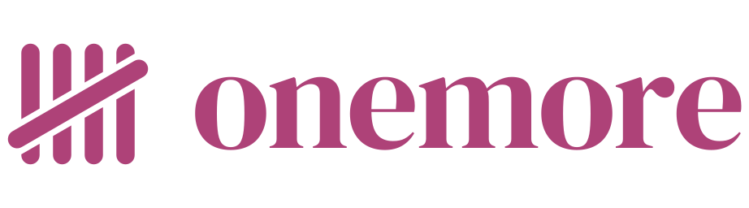
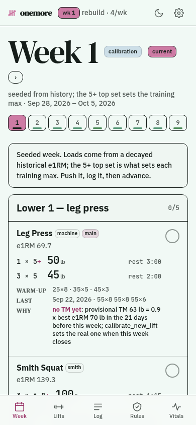
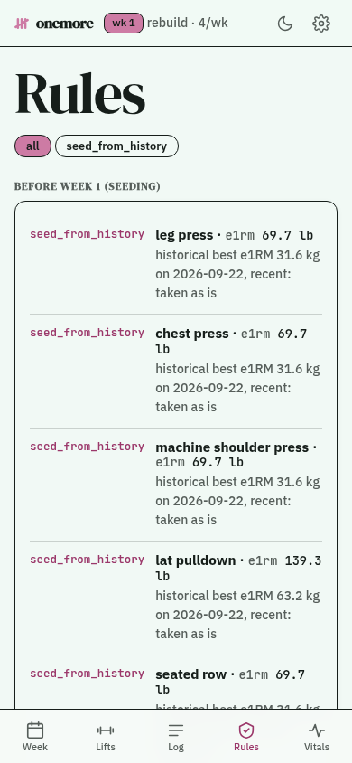

<h1>
  <picture>
    <source media="(prefers-color-scheme: dark)" srcset="docs/brand/onemore-horizontal-mono-cd7ba4.svg">
    
  </picture>
</h1>

[](https://github.com/tydude001/onemore/actions/workflows/ci.yml)
[](https://www.python.org/)
[](LICENSE)

A strength program that reads your workout log and writes next week's.

onemore doesn't replace your logger. [Strong](https://www.strong.app/) stays
the app you log in. onemore reads Strong's CSV export, lays out a multi-week
program with every load rounded to what your gym's dumbbells and pin stacks
actually go up in, and after each week adjusts the next one through a small
set of rules — each of which records what it changed and which logged sets
made it do so. It needs no RPE, has zero Python dependencies, and runs as one
page on your phone.

It's built for a gym of machines and dumbbells. The shipped equipment
catalog is a Planet Fitness: a Smith machine, selectorized machines, and
dumbbells to about 80 lb, with no barbell and no rack. A different gym is a
data file, not a fork — see [Your gym](#your-gym).

<p align="center">
  <picture>
    <source media="(prefers-color-scheme: dark)" srcset="docs/screenshots/week-dark.png">
    
  </picture>
  
</p>

<p align="center"><sub>From <code>onemore demo</code> — synthetic training history, nothing real.</sub></p>

## How a week works

1. **Train and log in Strong**, the way you already do. The week's plan is on
   the onemore page on your phone.
2. **Send the export.** In Strong, *Settings → Export Data → share* to an iOS
   Shortcut that posts the file to onemore. Sending your whole history every
   time is fine — an import skips any session it already holds. Each day it
   finds gets checked off on the page.
3. **Advance the week**, from the page or with `onemore advance`. The rules
   read what you actually lifted and set next week's loads.
4. **See why.** Every change shows up in the rules view (or
   `onemore explain`) alongside the sets that caused it.

The Shortcut is iOS, but the endpoint behind it is a plain HTTP `POST` of
the CSV, so anything that can send a file can feed it — or skip the phone
entirely and run `onemore import` on the export. Setting up the server and
the Shortcut is in [docs/deploy.md](docs/deploy.md).

## Quick start

You need [uv](https://docs.astral.sh/uv/getting-started/installation/); it
fetches Python 3.13 itself if you don't have it.

```bash
git clone https://github.com/tydude001/onemore.git
cd onemore
uv sync
uv run onemore demo       # a synthetic training history, a plan, and the web app — nothing real, nothing kept
```

To use it for real, export your history from Strong (*Settings → Export
Data*) and:

```bash
uv run onemore import path/to/your_strong_export.csv
uv run onemore status                 # history and estimated maxes per lift
uv run onemore start --days 4         # seeds training maxes from history, week 1 starts today
uv run onemore plan --week 1          # the week, loads rounded per machine
uv run onemore advance                # after the week's export lands: run the rules, move on
uv run onemore explain --week 1       # which rules fired, on which sets, and why
uv run onemore serve                  # the web app and the import endpoints — see docs/deploy.md
```

Optionally, `uv run onemore import-health path/to/export.zip` reads the
Apple Health export (*Health → your photo → Export All Health Data*) for
resting heart rate. Nothing requires it.

## Programs

**`rebuild`** is the default: a general 4-day upper/lower program for getting
back into training, on machines and dumbbells, with no injury assumed. Each
main lift runs a three-week wave of heavy top sets — a 5-rep, a 1-rep and a
3-rep target — worked out from its training max. Accessories sit at 75% of
their own estimated max, with the last set taken to as many reps as you can.
Week 1 is seeded from whatever history you imported
([`rebuild.py`](src/onemore/program/programs/rebuild.py)).

**`comeback`** is a program for returning from a radial head fracture. It is
not medical advice. Opt in with `--program comeback` or
`ONEMORE_PROGRAM=comeback`; either one also switches which program the web
app's Start button offers.

## The rules

Every rule that changes the plan writes an `Adjustment`: its name, what
changed, and the ids of the logged sets behind it. Nothing moves a number
silently, and `onemore explain` shows exactly why each one moved.

| Rule | Reads | Effect |
|---|---|---|
| `e1rm_refresh` | your best logged set per lift, rolling window | updates the lift's estimated max |
| `calibrate_tm` / `calibrate_new_lift` | the seeding week's, or a newly-added lift's, best set | sets a training max where none exists yet |
| `tm_progress` | the week's top AMRAP set against its target reps | progresses, holds, or (after two misses) cuts the training max 10%; a Strong note that a set hurt holds it instead of counting a miss |
| `e1rm_ceiling` | training max against the rolling estimated max | clamps the training max so it can't outrun demonstrated strength |
| `dumbbell_ceiling` | load against a lift's known ceiling | once the load can't go up, adds reps, then a set |
| `missed_week_repeat` | days logged this week | repeats the week instead of advancing |
| `deload_after_reductions` | this week's training-max cuts | inserts a deload after two lifts drop in the same week |
| `recovery_deload` | Apple Health resting heart rate, if you send it | inserts a deload when the week's mean sits well above your own 28-day baseline |
| `accessory_volume` | logged RPE, if your export carries any | trims or adds a set on non-main lifts; most exports carry none, so this one is usually silent |

No rule needs RPE, sleep, or HRV to run the plan — Strong logs almost none
of the first, and the other two are enrichment at best. Health data is
optional everywhere it's read. `ONEMORE_RHR_THRESHOLD` overrides the resting
heart rate margin `recovery_deload` uses (default +5.0 bpm, a measured
percentile rather than a guess — `scripts/recovery_threshold.py` measures
yours).

### The terms

- **Estimated max (e1RM)** — the heaviest single rep a logged set implies,
  from its load and reps (the Epley formula).
- **Training max** — a working number, 90% of your estimated max. Every
  main-lift load is a percentage of it.
- **AMRAP** — "as many reps as possible" on the last set. Beating its
  target by two or more is what moves the training max up.
- **Deload** — a lighter week inserted to recover.
- **RPE** — a 1–10 rating of how hard a set felt. onemore doesn't depend on
  it, because almost nobody logs it.

## Your gym

Equipment is data in
[`exercises.toml`](src/onemore/exercises.toml): each exercise's load step
and, where known, its ceiling — the heaviest dumbbell or the top of the pin
stack. Put your own `exercises.toml` in `$ONEMORE_DATA` and it overlays the
shipped one, so your steps and ceilings don't need a fork.
`uv run onemore status --unmapped` lists any exercise name Strong logged
that the catalog doesn't know yet.

## Privacy and running it

Everything onemore reads or writes lives in one SQLite file and the exports
you gave it, all under your own data directory. Nothing is sent anywhere,
ever — there's no outgoing network call in the whole program, `onemore
serve` included; it only answers requests you send it.

`onemore serve` binds `127.0.0.1` by default. Running it on any address
other than loopback or a private network you control (a tailnet, a
WireGuard mesh) is unsupported: its GET routes carry no authentication at
all, and only writes need the token. [docs/deploy.md](docs/deploy.md) runs
it as a container with no image to build;
[SECURITY.md](SECURITY.md) is where to report a vulnerability.

## Scope

onemore is at 0.1: single-user and maintained by one person. It reads
Strong's export only — not Hevy or other loggers, though
[the research notes](docs/research/hevy-api-and-strong-csv.md) compare the
two formats.

## Further reading

- [PLAN.md](PLAN.md) — the architecture and program model, and the why
  behind choices like dropping RPE.
- [docs/research/](docs/research/) — dated research notes with citations:
  what Strong's export actually holds, and how other trackers do it.
- [docs/design.md](docs/design.md) — the web app's design system.

## Contributing

[CONTRIBUTING.md](CONTRIBUTING.md) has the rules a pull request is checked
against. Please never paste real training or health data into an issue.

## Not affiliated

onemore is not affiliated with, endorsed by, or officially connected to
Strong, Apple, or Planet Fitness. It's an independent tool that reads a CSV
export and a health export you already have.
